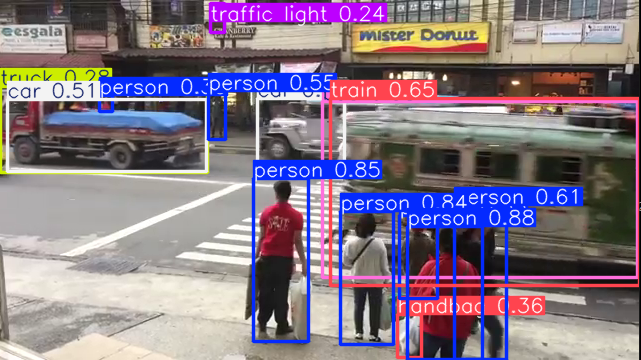
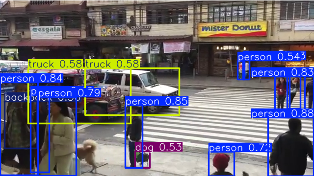
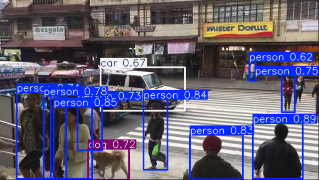

# Object Detection on Video (YOLOv8 + OpenCV)

This project explores object detection on real world street footage using a pretrained YOLOv8 model. The goal was to understand how confidence thresholds affect detection quality, false positives, and missed detections in a video setting (rather than build a production system).

## Demo Context
- **Footage:** Pedestrian crossing in the Philippines (people + cars + buses + street signage)
- **Model:** YOLOv8 (pretrained COCO weights)
- **Focus:** Comparing confidence thresholds and observing real world failure modes

---

## How it works (simple pipeline)
1. Read video frames using OpenCV
2. Run object detection per frame using YOLOv8
3. Draw bounding boxes, class labels, and confidence scores
4. Display the annotated video and optionally save an output file

---

## Experiments: Confidence Threshold Comparison

I ran the same video through the detector with three confidence thresholds and compared results.

### 1) `--conf 0.20` (more detections, more mistakes)
At **0.20**, the model draws many boxes. A lot are correct, but there are more misclassifications and occasional confusion between similar looking objects.

**Observed issues in this run:**
- A **street sign** was misidentified as a **traffic light**
- A **bus** was misidentified as a **train**
- A **truck** was misidentified as a **car**

**Takeaway:** Lower thresholds increase recall (more detections), but also increase noise and misidentifications.

---

### 2) `--conf 0.35` (balanced, more stable)
At **0.35**, there are fewer boxes, and the detections are generally more stable and confident. This setting felt like the best trade off for the footage.

**What improved vs 0.20:**
- Fewer incorrect boxes overall
- More consistent labels on obvious objects
- Better balance between missing objects and false positives

**What still went wrong:**
- Some misidentifications remain (e.g., a **bag** misidentified as a **dog**)

**Takeaway:** This setting was a good middle ground — still able to detect smaller items like handbags/umbrellas more reliably than 0.20, without becoming overly conservative.

---

### 3) `--conf 0.60` (very conservative)
At **0.60**, the model becomes much more selective. It tends to avoid uncertain detections but can miss smaller or partially occluded objects.

**Takeaway:** Higher thresholds reduce false positives but can reduce coverage, especially for small objects or objects at distance.

---

## What I learned
- Confidence threshold tuning is essential: **lower = more detections but more errors**, **higher = fewer errors but more misses**.
- Even strong pretrained models can confuse visually similar classes (e.g., buses/trains, signs/traffic lights).
- Real world conditions (angle, distance, motion blur, occlusion) influence detection quality significantly.

---

## Limitations
- This project uses a **pretrained model** without fine tuning on local footage.
- No labelled ground truth dataset was used, so evaluation here is **qualitative** (based on observed behaviour).
- Counts printed by the script are rough (frame level detections, not tracked objects).

---

## How to run

1) Setup  
Create and activate a virtual environment, then install dependencies:

pip install -r requirements.txt

2) Run on a video file  
Place a video at `data/input.mp4` (or update the path), then run:

python src/detect_video.py --source data/input.mp4 --conf 0.35 --save

3) Run on webcam  

python src/detect_video.py --source 0 --conf 0.35 --save

Controls  
- SPACE: pause / resume  
- q: quit

